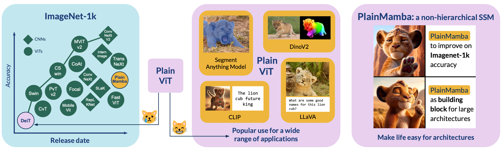

# PlainMamba: Improving Non-hierarchical Mamba in Visual Recognition
<p align="center">

</p>

This repository contains the official PyTorch implementation of our paper:

[PlainMamba: Improving Non-hierarchical Mamba
in Visual Recognition, *Chenhongyi Yang**, *Zehui Chen**, *Miguel Espinosa**, *Linus Ericsson*, *Zhenyu
Wang*, *Jiaming Liu*,  *Elliot J. Crowley*, BMVC 2024](https://arxiv.org/pdf/2403.17695.pdf)

## Usage

### Environment Setup
Our classification codebase is built upon the MMClassification toolkit (old version).
```shell
conda create -n plain_mamba python=3.10 -y
source activate plain_mamba
pip install torch==1.13.1+cu116 torchvision==0.14.1+cu116 -f https://download.pytorch.org/whl/torch_stable.html --no-cache
conda install -c conda-forge cudatoolkit-dev # Optional, only needed when facing cuda errors
pip install -U openmim
mim install mmcv-full
pip install mamba-ssm
pip install mlflow fvcore timm lmdb
cd plain_mamba
pip install -e .

cd downstream/mmdetection  # set up object detection and instance segmentation
pip install -e . 
cd downstream/mmsegmentation # set up semantic segmentation
pip install -e .
```

### Data Preparation

For ImageNet experiment, we convert the dataset to LMDB format for efficient data loading. You can convert the dataset by running:
```shell
python tools/dataset_tools/create_lmdb_dataset.py \
       --train-img-dir data/imagenet/train \
       --train-out data/imagenet/imagenet_lmdb/train \
       --val-img-dir data/imagenet/val \
       --val-out data/imagenet/imagenet_lmdb/val
```
You will also need to download the ImageNet meta data from [Link](https://download.openmmlab.com/mmclassification/datasets/imagenet/meta/caffe_ilsvrc12.tar.gz).

For downstream tasks, please follow [MMDetection](https://github.com/open-mmlab/mmdetection/) and [MMSegmentation](https://github.com/open-mmlab/mmsegmentation/) to set up your datasets.

After setting up, the datasets file structure should be as the following:
```
PlainMamba
|-- ...
|-- data
|   |__ imagenet
|       |-- imagenet_lmdb
|       |   |-- train
|       |   |   |-- data.mdb
|       |   |   |__ lock.mdb
|       |   |-- val
|       |   |   |-- data.mdb
|       |   |   |__ lock.mdb 
|       |__ meta
|           |__ ...
|__ downstream 
    |-- mmsegmentation
    |   |-- ...
    |   |__ data
    |       |__ ade
    |           |__ ADEChallengeData2016
    |               |-- annotations
    |               |   |__ ...
    |               |-- images
    |               |   |__ ...
    |               |-- objectInfo150.txt
    |               |__ sceneCategories.txt
    |   
    |__ mmdetection
        |-- ...
        |__ data
            |__ coco
                |-- train2017
                |   |__ ...
                |-- val2017
                |   |__ ...
                |__ annotations
                    |-- instances_train2017.json
                    |-- instances_val2017.json
                    |__ ...
      

``` 

### ImageNet Classification
#### Training PlainMamba
```shell
# Example: Training PlainMamba-L1 model
zsh tool/dist_train.sh plain_mamba_configs/plain_mamba_l1_in1k_300e.py 8 
```
#### Testing PlainMamba
```shell
# Example: Testing PlainMamba-L1 model
zsh tool/dist_test.sh plain_mamba_configs/plain_mamba_l1_in1k_300e.py work_dirs/plain_mamba_l1_in1k_300e/epoch_300.pth 8 --metrics accuracy
```
### COCO Object Detection and Instance Segmentation

Run `cd downstream/mmdetection` first. 

#### Training Mask R-CNN using PlainMamba-Adapter
```shell
# Example: Training PlainMamba-Adapter-L1 Mask R-CNN with 1x schedule
zsh tools/dist_train.sh plain_mamba_det_configs/maskrcnn/l1_maskrcnn_1x.py 8
```

#### Training RetinaNet using PlainMamba-Adapter
```shell
# Example: Training PlainMamba-Adapter-L1 RetinaNet with 1x schedule
zsh tools/dist_train.sh plain_mamba_det_configs/retinanet/l1_retinanet_1x.py 8
```

#### Testing Mask R-CNN
```shell
# Example: Testing PlainMamba-Adapter-L1 Mask R-CNN 1x model
zsh tools/dist_test.sh plain_mamba_det_configs/maskrcnn/l1_maskrcnn_1x.py work_dirs/l1_maskrcnn_1x/epoch_12.pth 8 --eval bbox segm
```

#### Testing RetinaNet
```shell
# Example: Testing PlainMamba-Adapter-L1 RetinaNet 1x model
zsh tools/dist_test.sh plain_mamba_det_configs/retinanet/l1_retinanet_1x.py work_dirs/l1_retinanet_1x/epoch_12.pth 8 --eval bbox
```


### ADE20K Semantic Segmentation

Run `cd downstream/mmsegmentation` first.
#### Training UperNet using PlainMamba
```shell
# Example: Training PlainMamba-L1 based UperNet
zsh tools/dist_train.sh plain_mamba_seg_configs/l1_upernet.py 8
```
#### Testing UperNet
```shell
# Example: Testing PlainMamba-L1 based UperNet
zsh tools/dist_test.sh plain_mamba_seg_configs/l1_upernet.py work_dirs/l1_upernet/iter_160000.pth 8 --eval mIoU
```

## Benchmark results

### ImageNet-1k Classification
|  Model   | #Params (M) | Top-1 Acc | Top-5 Acc |                                                     Config                                                      |                                    Model                                     |
|:--------:|:-----------:|:---------:|:---------:|:---------------------------------------------------------------------------------------------------------------:|:----------------------------------------------------------------------------:|
| PlainMamba-L1 |     7.3     |   77.9    |   94.0    | [Link](https://github.com/ChenhongyiYang/PlainMamba/blob/main/plain_mamba_configs/plain_mamba_l1_in1k_300e.py)  | [Link](https://huggingface.co/ChenhongyiYang/PlainMamba/resolve/main/l1.pth) |
| PlainMamba-L2 |    25.7     |   81.6    |   95.6    | [Link](https://github.com/ChenhongyiYang/PlainMamba/blob/main/plain_mamba_configs/plain_mamba__l2_in1k_300e.py) | [Link](https://huggingface.co/ChenhongyiYang/PlainMamba/resolve/main/l2.pth) |
| PlainMamba-L3 |    50.5     |   82.3    |   95.9    | [Link](https://github.com/ChenhongyiYang/PlainMamba/blob/main/plain_mamba_configs/plain_mamba_l3_in1k_300e.py)  | [Link](https://huggingface.co/ChenhongyiYang/PlainMamba/resolve/main/l3.pth) |

### COCO Mask R-CNN 1x Schedule
|         Model         | #Params (M) | AP Box | AP Mask |                                                                  Config                                                                  |                                               Model                                                |
|:---------------------:|:-----------:|:------:|:-------:|:----------------------------------------------------------------------------------------------------------------------------------------:|:--------------------------------------------------------------------------------------------------:|
| PlainMamba-Adapter-L1 |     31      |  44.1  |  39.1   | [Link](https://github.com/ChenhongyiYang/PlainMamba/blob/main/downstream/mmdetection/plain_mamba_det_configs/maskrcnn/l1_maskrcnn_1x.py) | [Link](https://huggingface.co/ChenhongyiYang/PlainMamba/resolve/main/detection/maskrcnn/l1_1x.pth) |
| PlainMamba-Adapter-L2 |     53      |  46.0  |  40.6   | [Link](https://github.com/ChenhongyiYang/PlainMamba/blob/main/downstream/mmdetection/plain_mamba_det_configs/maskrcnn/l2_maskrcnn_1x.py) | [Link](https://huggingface.co/ChenhongyiYang/PlainMamba/resolve/main/detection/maskrcnn/l2_1x.pth) |
| PlainMamba-Adapter-L3 |     79      |  46.8  |  41.2   | [Link](https://github.com/ChenhongyiYang/PlainMamba/blob/main/downstream/mmdetection/plain_mamba_det_configs/maskrcnn/l3_maskrcnn_1x.py) | [Link](https://huggingface.co/ChenhongyiYang/PlainMamba/resolve/main/detection/maskrcnn/l3_1x.pth) |


### COCO RetinaNet 1x Schedule
|      Model       | #Params (M) | AP Box |                                                                Config                                                                 |                                                Model                                                |
|:----------------:|:-----------:|:------:|:-------------------------------------------------------------------------------------------------------------------------------------:|:---------------------------------------------------------------------------------------------------:|
| PlainMamba-Adapter-L1 |     19      |  41.7  | [Link](https://github.com/ChenhongyiYang/PlainMamba/blob/main/downstream/mmdetection/plain_mamba_det_configs/retinanet/l1_retinanet_1x.py) | [Link](https://huggingface.co/ChenhongyiYang/PlainMamba/resolve/main/detection/retinanet/l1_1x.pth) |
| PlainMamba-Adapter-L2 |     40      |  43.9  | [Link](https://github.com/ChenhongyiYang/PlainMamba/blob/main/downstream/mmdetection/plain_mamba_det_configs/retinanet/l2_retinanet_1x.py) | [Link](https://huggingface.co/ChenhongyiYang/PlainMamba/resolve/main/detection/retinanet/l2_1x.pth) |
| PlainMamba-Adapter-L3 |     67      |  44.8  | [Link](https://github.com/ChenhongyiYang/PlainMamba/blob/main/downstream/mmdetection/plain_mamba_det_configs/retinanet/l3_retinanet_1x.py) | [Link](https://huggingface.co/ChenhongyiYang/PlainMamba/resolve/main/detection/retinanet/l3_1x.pth) |


### ADE20K UperNet
|   Model  | #Params (M) | mIoU |                                                             Config                                                             |                                               Model                                               |
|:--------:|:-----------:|:----:|:------------------------------------------------------------------------------------------------------------------------------:|:-------------------------------------------------------------------------------------------------:|
| PlainMamba-L1 |     35      | 44.1 | [Link](https://github.com/ChenhongyiYang/PlainMamba/blob/main/downstream/mmsegmentation/plain_mamba_seg_configs/l1_upernet.py) | [Link](https://huggingface.co/ChenhongyiYang/PlainMamba/resolve/main/segmentation/l1_upernet.pth) |
| PlainMamba-L2 |     55      | 46.8 | [Link](https://github.com/ChenhongyiYang/PlainMamba/blob/main/downstream/mmsegmentation/plain_mamba_seg_configs/l2_upernet.py) | [Link](https://huggingface.co/ChenhongyiYang/PlainMamba/resolve/main/segmentation/l2_upernet.pth) |
| PlainMamba-L3 |     81      | 49.1 | [Link](https://github.com/ChenhongyiYang/PlainMamba/blob/main/downstream/mmsegmentation/plain_mamba_seg_configs/l3_upernet.py) | [Link](https://huggingface.co/ChenhongyiYang/PlainMamba/resolve/main/segmentation/l3_upernet.pth) |


## Citation
```
@inproceedings{Yang_2024_BMVC,
author    = {Chenhongyi Yang and Zehui Chen and Miguel Espinosa and Linus Ericsson and Zhenyu Wang and Jiaming Liu and Elliot J. Crowley},
title     = {PlainMamba: Improving Non-Hierarchical Mamba in Visual Recognition},
booktitle = {35th British Machine Vision Conference 2024, {BMVC} 2024, Glasgow, UK, November 25-28, 2024},
publisher = {BMVA},
year      = {2024}
}
```
